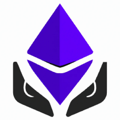

<div id="top"></div>

<br />
<div align="center">
  <a href="https://github.com/thegiving/thegivingdao/">
    
  </a>

<h3 align="center">The Giving - A Fully Decentralized GoFundMe</h3>

</div>

## About The Project

[![Product Name Screen Shot][product-screenshot]](https://github.com/thegiving/thegivingdao/)

The Giving is a fully decentralized charity organization like GoFundMe which is able to accept donations in crypto or fiat currencies. 

### Built With

- [Next.js](https://nextjs.org/docs)
- [Tailwind CSS](https://tailwindcss.com/)
- [Solidity](https://soliditylang.org/)
- [Polygon](https://polygon.technology/)
- [The Graph](https://thegraph.com/en/)


<!-- GETTING STARTED -->

## Getting Started

To get this application up and and running on your local machine follow these simple steps.

### Prerequisites

You need to have Node.js, NPM and hardhat installed on your computer, before running this project.

### Installation (for dev)

> Clone the repo and cd to the project
   ```sh
   git clone https://github.com/thegiving/thegivingdao thegiving
   cd thegiving
   ```

> install and start your 👷‍ Hardhat chain:

   ```sh
   yarn install
   yarn chain
   ```

> in a second terminal window, 🛰 deploy your contract:
   ```sh
   yarn hardhat:local-deploy
   ```

### Deploy to Polygon Mumbai:

Coming Soon... 🎉


<!-- > Get your contract address and paste in in `connectContract.js`

> Deploy subgraph in `subragph` directory by following steps in `subgraph/README.md` (optional, since it is already deployed in hosted service)

> Get subgraph query endpoint after deployment and update it in `apollo-client.js`

    ```js
    const client = new ApolloClient({
      uri: "YOUR_SUBGRAPH_LINK_HERE", // <-- Update this
      cache: new InMemoryCache(),
    });
    ``` -->

[product-screenshot]: packages/frontend/public/sample_landing_page.jpg
