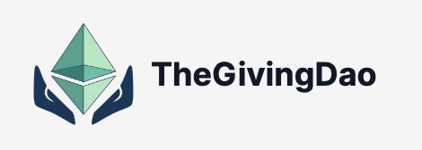

<div id="top"></div>
<br />

<div align="center" className="bg-white">
  <a href="https://github.com/thegiving/thegivingdao/">
    
  </a>

<h3 align="center">The Giving - A Fully Decentralized Crowdfunding Platform</h3>
<h3 align="center"> 🎉 ETH Global 2022 Hackathon First Place Winner of Spruce's Best Use of Sign in With Ethereum! 🚀 </h3>


</div>

## About The Project

[![Product Name Screen Shot][product-screenshot]](https://github.com/thegiving/thegivingdao/)

The Giving is a fully decentralized charity organization like GoFundMe which is able to accept donations in crypto or fiat currencies.

### Built With

- [Next.js](https://nextjs.org/docs)
- [Tailwind CSS](https://tailwindcss.com/)
- [Solidity](https://soliditylang.org/)
- [Polygon](https://polygon.technology/)
- [The Graph](https://thegraph.com/en/)

<!-- GETTING STARTED -->

# 🏄‍♂️ Quick Start Options

**_Note_**: ./.devcontainer/devcontainer.json (or set your own if using Option 2 below) There are environmental variables
that are set and may need to be updated to reflect accurate values.

```json
{
    "containerEnv":{
        "STAGING_INFURA_URL":"<Infura URL >", # https://infura.io/ create project Eth->mumbai
        "STAGING_PRIVATE_KEY":"<Infura PK>", # currently set with a burner
        "ETHERSCAN_API_KEY":"<Etherscan API Key>" # https://etherscan.io/myapikey (set one up for yourself)
    }
}
```

## Option 1 | .devcontainer super speed [Using Docker]

### Using VScode

- Docker Desktop (windows)/Docker (linux)/Remote Docker connection with docker cli installed
- Ensure vscode extention: `ms-vscode-remote.vscode-remote-extensionpack` is installed
- Clone this repo and open in VScode
  - the IDE should detect the Dev Container configuration file.
  - Select [(Re)Open in Container]
  - the Docker container will build itself and auto attache itself to VSCode.
- If you want to start everything using `launch.json` with associated `task.json`
  - Switch to [Run and Debug] Side menu
  - A Green Right Arrow with Dropdown should be viewable. Select and Play
    - (1) [Start Project Chain] for `yarn install && yarn chain` in debug mode
    - (2) [Compile Contract(s)] for `yarn hardhat:local-deploy` in debug mode
      - note: this debug mode will auto close if the contracts are successful
    - (3) [Start Frontend] for `yarn frontend` in deubg mode
- Once all this is setup, you should be able to:
  - connect using localhost:8545 (Metamask) network
  - see "Hello World" at https://localhost:3000

## Option 2 | The traditional set up your own env.

Prerequisites: [Node (v16 LTS)](https://nodejs.org/en/download/) plus [Yarn](https://classic.yarnpkg.com/en/docs/install/) and [Git](https://git-scm.com/downloads)

To get this application up and and running on your local machine follow these simple steps.

### Prerequisites

You need to have Node.js, NPM and hardhat installed on your computer, before running this project.

### Installation

> Clone the repo and cd to the project

```sh
git clone https://github.com/thegiving/thegivingdao thegiving
cd thegiving
```

> install and start your 👷‍ Hardhat chain:

```sh
yarn install
yarn chain
```

> in a second terminal window, 🛰 deploy your contract:

```sh
yarn hardhat:local-deploy
```

> in a third terminal window, start your 📱 frontend:

```sh
yarn frontend
```

### Deploy to Polygon Mumbai:

> when you're ready to deploy to testnet:

```sh
yarn hardhat:testnet-deploy
```

> automatically verify your contract:

```sh
yarn hardhat:testnet-verify
```

### ...and you're done! 🎉

<br>

# 📚 Documentation

For documentation visit: [docs.thegiving.io](https://www.notion.so/EthOnline-Decentralized-GoFundMe-65275a7a75d745c0aa95731627d96d0c)

<!-- > Get your contract address and paste in in `connectContract.js`

> Deploy subgraph in `subragph` directory by following steps in `subgraph/README.md` (optional, since it is already deployed in hosted service)

> Get subgraph query endpoint after deployment and update it in `apollo-client.js`

    ```js
    const client = new ApolloClient({
      uri: "YOUR_SUBGRAPH_LINK_HERE", // <-- Update this
      cache: new InMemoryCache(),
    });
    ``` -->

[product-screenshot]: packages/frontend/public/landing_page_sample.png
